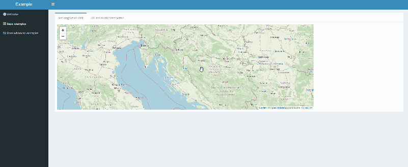

# Shiny leaflet examples

## Description

This repository tries to show the capabilities of the R [Shiny package](https://shiny.rstudio.com/) combined with the javascript library [leaflet](https://leafletjs.com/).

## Getting Started 

### Dependencies

The code was developed under Windows with 

- [R 4.2.1](https://www.r-project.org/)
- [RStudio 2022.07.2+576](https://posit.co/downloads/) "Spotted Wakerobin" Release (e7373ef832b49b2a9b88162cfe7eac5f22c40b34, 2022-09-06) 
- [Posit package manager](https://packagemanager.posit.co/cran/2022-11-04+pzBGwG7v) repository freeze 11.4.2022

R package dependencies are listed in the DESCRIPTION file under **Imports**.

The gifs are created with [ScreenToGif 2.36](https://www.screentogif.com/).

## Examples

### Basic examples

#### Example 1 

A click triggers a marker to popup. Also a text output is updated with the longitude and latitude of the marker.

#### Example 2

A map and a table are shown. Clicking a marker on the map selects the corresponding row in the table. Selecting rows in the table draws circles around the corresponding markers.

#### Example 3

A map is shown with the default leaflet marker. Multiple options of custom markers (red circle, blue rectangle, custom shape) can be selected with a radio button. The position of the custom marker and the width and height can be adjusted with numeric inputs. After clicking the update marker button the custom markers are shown instead of the default ones.

